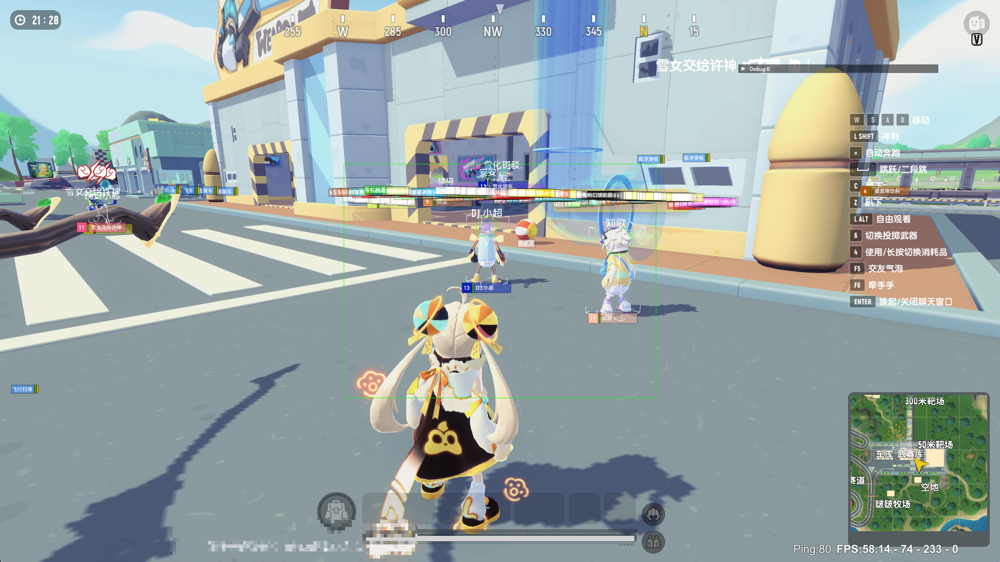

<meta name="msvalidate.01" content="83D2568AE3F4DC86F77D405A6A33D7EB" />

    
     

> [!CAUTION]
> 请勿用于商业行为，衍生作品发布需提供源代码

> [!IMPORTANT]
> 如果对此项目感兴趣，欢迎加入一起开发

> [!TIP]
> 群里有成品，需要的自行加群下载 \
> Q群1：838737409 \
> Q群2：1047366290

### 免责声明
1. 学习交流、科研等非商业性质的用途，严禁将本软件用于任何商业目的。
2. 因使用本软件（包括但不限于第三方对本软件的修改、分发等行为）所产生的任何直接或间接后果，均由使用者本人承担，与本软件及其制作者无关。
3. 本软件及制作者不对因使用本软件导致的任何损失或法律责任承担任何责任。
4. 用户需自行承担使用本软件的风险。

### 隐私政策
1. 本软件不会主动收集、存储或上传您的任何个人信息，所有信息均为本地离线使用，仅限于程序运行所需的最基本配置信息，不涉及任何个人身份信息。
2. 如有第三方修改本软件导致的信息收集、传输等行为，均属于个人行为，与本软件及制作者无关。

### 服务协议
1. 用户在使用本软件前应仔细阅读并同意本服务协议。
2. 本软件为免费产品，开发者有权随时对软件进行更新、升级或终止服务，无需另行通知。
3. 用户不得利用本软件从事任何违法违规活动，若因用户行为导致的法律责任，由用户自行承担。
4. 本协议未尽事宜，开发者保留最终解释权。

### 功能图

